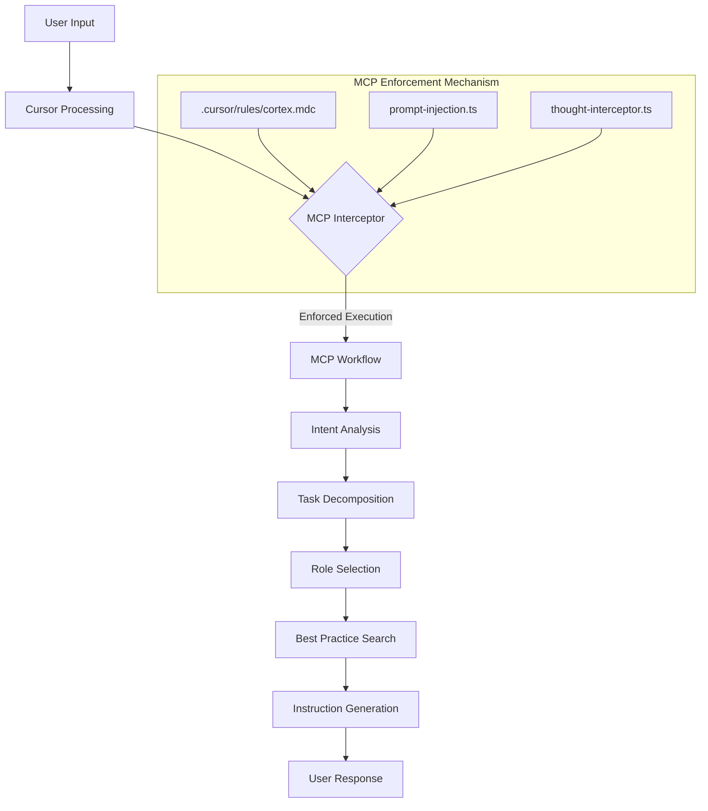
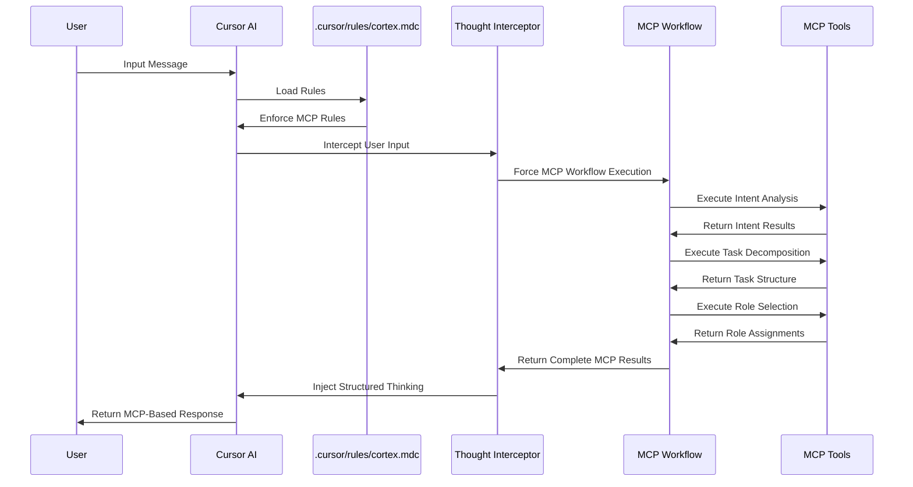

# Cortex AI

[](https://github.com/RikaiDev/cortex/releases)
[](LICENSE)
[](https://nodejs.org/)

[English](README.md) | [繁體中文](README.zh-TW.md) | [Documentation](docs/) | [Updates](docs/updates/) | [Changelog](CHANGELOG.md)

## 🧠 AI Collaboration Brain

**Cortex AI** is an AI collaboration system that transforms AI models into intelligent, learning partners. It solves the core problem of AI inconsistency and lack of memory through **prompt injection** and **real-time preference learning**.

### 🎯 **Why Cortex?**

**The Problem:**

- AI models lack stable thinking processes (Chain-of-Thought)
- AI forgets user preferences and repeats the same mistakes
- Different AI platforms behave inconsistently
- No personalization or learning from conversation

**The Solution:**

- **🧠 Brain** - Structured thinking through prompt injection
- **📚 Experience** - Real-time learning from user feedback
- **🔄 Evolution** - Continuous improvement without repeating mistakes

### 🏗️ **Architecture**

```
🧠 Brain (MDC/GEMINI/CLAUDE)
├── Real-time thinking and decision making
├── Structured 5-step thinking process
├── User preference learning from conversation
└── Cross-platform consistency

📚 Experience (docs)
├── Long-term memory and knowledge base
├── Project-specific patterns and conventions
├── Learning from successful interactions
└── Continuous knowledge evolution

🛠️ Essential Tools
├── Prompt injection for AI enhancement
├── User preference detection and application
├── Cross-platform adapter system
└── Simplified CLI for core operations
```

### Cortex Philosophy

**Cortex AI** represents our core philosophy for transforming AI interactions:

1. **Few-Shot to Fine-Tune Transformation** - We transform simple few-shot examples into comprehensive fine-tune prompts automatically, eliminating the need for manual prompt engineering.

2. **Hook-Based Interception System** - Our architecture intercepts all user inputs and processes them through a structured pipeline that guarantees consistent quality and behavior.

3. **Deterministic Expansion Over Randomness** - Rather than relying on emergent behaviors, we systematically expand minimal user inputs into complete, well-structured instructions.

4. **Guaranteed Processing Pipeline** - Every user input is processed through our complete pipeline with 100% execution rate, ensuring no step is ever skipped.

5. **Explicit Reasoning and Documentation** - All transformations from few-shot to fine-tune are explicit, documented, and traceable through our workflow.

This philosophy drives our implementation of an intelligent system that transforms simple user inputs (few-shot examples) into comprehensive, production-ready fine-tune prompts through mandatory processing steps.

#### MCP Workflow Architecture



#### MCP Processing Sequence



## ✨ **Core Features**

### **🧠 Structured Thinking**

- **6-Step Thinking Process**: Intent Exploration → Problem Analysis → Knowledge Integration → Solution Development → Implementation Planning → Quality Validation
- **Mandatory Protocol**: Forces AI to think systematically, regardless of model capabilities
- **Quality Validation**: Ensures complete and logical thinking

### **📚 Real-Time Learning**

- **User Preference Detection**: Learns from keywords like "不對", "我們用", "不要"
- **Immediate Application**: Applies learned preferences to current response
- **No Repetition**: Never repeats corrected mistakes
- **Frustration Detection**: Recognizes and learns from user frustration

### **🔄 Cross-Platform Consistency**

- **Cursor Integration**: Enhanced MDC with preference learning
- **Claude Support**: Context-aware system messages
- **Gemini Support**: Platform-specific prompt engineering
- **Unified Behavior**: Same learning and thinking across all platforms

## 🚀 **Quick Start**

### **Installation**

```bash
# Global installation
npm install -g @rikaidev/cortex

# Or using npx
npx @rikaidev/cortex
```

### **Initialize Project**

```bash
# Initialize Cortex AI in your project
cortex init

# Generate IDE configurations
cortex generate-ide
```

### **Start Learning**

```bash
# Start AI collaboration
cortex start

# Show version
cortex version
```

## 🎯 **How It Works**

### **1. Learning from Conversation**

```
User: "註解又開始寫中文了？"
AI: [Learns] Write all comments in English
User: "我們用 uv run pytest"
AI: [Learns] Always use uv run for Python commands
User: "又來了"
AI: [Learns] Don't repeat the same mistake
```

### **2. Structured Thinking**

```
🔍 ANALYSIS PHASE: [Problem understanding]
📚 KNOWLEDGE INTEGRATION: [Apply learned preferences]
💡 SOLUTION DEVELOPMENT: [Consider user preferences]
⚡ IMPLEMENTATION PLAN: [Respect user patterns]
✅ QUALITY VALIDATION: [Ensure preference compliance]
```

### **3. Cross-Platform Consistency**

- **Same learning** across Cursor, Claude, and Gemini
- **Same thinking** process on all platforms
- **Same preferences** applied everywhere
- **Same evolution** through conversation

## 📚 **Documentation**

- **[Getting Started](docs/getting-started.md)** - Quick setup guide
- **[AI Collaboration](docs/ai-collaboration/)** - System architecture and roles
- **[Experience Learning](docs/experiences/)** - Learning and improvement system
- **[Updates & Notifications](docs/updates/)** - Stay informed about changes
- **[Roadmap](ROADMAP.md)** - Future development plans

## 🛠️ **Development**

### **Prerequisites**

- Node.js 18+
- TypeScript knowledge

### **Setup**

```bash
# Clone repository
git clone https://github.com/RikaiDev/cortex.git
cd cortex

# Install dependencies
npm install

# Build project
npm run build

# Run tests
npm run test

# Start development
npm run dev
```

### **Contributing**

- [Contributing Guidelines](CONTRIBUTING.md)
- [Code of Conduct](CODE_OF_CONDUCT.md)
- [Development Setup](docs/development/)

## 🎯 **Why "Cortex"?**

**Cortex (大腦皮質)** represents the brain's advanced cognitive functions:

- **🧠 Thinking** - Structured reasoning and problem-solving
- **📚 Memory** - Learning and storing experiences
- **🔄 Evolution** - Continuous improvement through experience
- **🎯 Decision** - Making informed choices based on learning

Just like the human cerebral cortex, **Cortex AI** is the "brain" for AI systems - responsible for thinking, memory, learning, and decision-making.

---

**Transform your AI interactions from frustrating repetitions to intelligent, learning partnerships with Cortex AI.**
