# Cortex AI

[](https://github.com/RikaiDev/cortex/releases)
[](LICENSE)
[](https://nodejs.org/)

[English](README.md) | [繁體中文](README.zh-TW.md) | [Documentation](docs/) | [Changelog](CHANGELOG.md)

## What is Cortex AI?

**Cortex AI** is a stable, structured development workflow system that transforms AI-assisted development from unpredictable "vibe coding" into reliable, quality-driven feature delivery.

Built on the **MCP (Model Context Protocol)**, Cortex provides a **constitution-driven, template-based workflow** that ensures consistent output regardless of which AI model you use
(Cursor, Claude, Copilot, or others).

### The Problem

Traditional AI-assisted development suffers from:
- **Unpredictable output quality** - AI generates different results each time
- **No quality gates** - Features built without validation checkpoints
- **Inconsistent structure** - Every developer gets different file structures
- **Runaway AI** - AI continues without user confirmation, creating unwanted changes

### The Solution

Cortex AI introduces **Stable Workflow System**:
- **Template + Command Architecture** - Structured templates with AI execution guidance
- **Constitution-Driven Validation** - Every phase checked against project principles
- **Mandatory User Checkpoints** - Explicit confirmation before proceeding to next phase
- **Automatic Quality Validation** - Built-in checklists and tech stack detection

---

## ⚡ Quick Start

### 1. Install Cortex

```bash
# Global installation
npm install -g @rikaidev/cortex

# Or use npx (no installation)
npx @rikaidev/cortex init
```

### 2. Initialize Your Project

```bash
cd your-project
cortex init
```

This creates `.cortex/` directory with templates, constitution, and workflow structure.

### 3. Setup MCP Client

**Cursor:**
```json
{
  "mcpServers": {
    "cortex-ai": {
      "command": "npx",
      "args": ["-y", "@rikaidev/cortex@latest", "start"]
    }
  }
}
```

**Claude Code:**
```bash
claude mcp add cortex npx -y @rikaidev/cortex@latest start
```

### 4. Start Your First Feature

```bash
# In your AI assistant
spec "Add user authentication with email and password"
```

Output: Workflow `001-add-user-auth` created

### 5. Follow the Workflow

```bash
# Commands automatically use the latest workflow
# (workflowId is optional - omit to use latest)

# Optional: Clarify ambiguities
clarify

# Generate implementation plan
plan

# Optional: Technical review
review

# Break down into tasks
tasks

# Execute implementation
implement
```

> **Note**: All commands default to the most recent workflow. You can still specify a workflow ID if needed: `plan 001-add-user-auth`

---

## 📊 Workflow Visualization

```mermaid
flowchart LR
    Start([User Request]) --> FirstTime{First<br/>Time?}
    
    FirstTime -->|Yes| Onboard[Onboard<br/>Interactive Setup]
    Onboard --> Constitution
    FirstTime -->|No| Constitution
    
    Constitution[Constitution<br/>Setup Principles] -->|Auto-apply| Spec
    
    Spec[Specification<br/>Define Requirements] -->|Review & Confirm| Decision1{User<br/>Satisfied?}
    
    Decision1 -->|No| Clarify[Clarify<br/>Resolve Ambiguities]
    Clarify -->|Update Spec| Spec
    Decision1 -->|Yes| Plan
    
    Plan[Plan<br/>Technical Design] -->|Review & Confirm| Decision2{User<br/>Satisfied?}
    
    Decision2 -->|No| Review[Review<br/>Technical Analysis]
    Review -->|Feedback| Plan
    Decision2 -->|Yes| Tasks
    
    Tasks[Tasks<br/>Break Down Work] -->|Review & Confirm| Decision3{User<br/>Ready?}
    
    Decision3 -->|No| Tasks
    Decision3 -->|Yes| Implement
    
    Implement[Implement<br/>Execute Tasks] --> Done{Release?}
    
    Done -->|Yes| Release[Release<br/>Analyze & Commit]
    Release --> Complete([Released])
    Done -->|No| Complete
    
    style Constitution fill:#e1f5ff
    style Spec fill:#e1f5ff
    style Clarify fill:#fff4e1
    style Plan fill:#e1f5ff
    style Review fill:#fff4e1
    style Tasks fill:#e1f5ff
    style Implement fill:#e1f5ff
    style Onboard fill:#d4f1d4
    style Release fill:#d4f1d4
    style FirstTime fill:#2b2b2b,color:#fff
    style Decision1 fill:#2b2b2b,color:#fff
    style Decision2 fill:#2b2b2b,color:#fff
    style Decision3 fill:#2b2b2b,color:#fff
    style Done fill:#2b2b2b,color:#fff
```



**Legend:**
- 🔵 **Blue boxes** - AI execution phases
- 🟡 **Yellow boxes** - Optional user interaction phases
- 🟢 **Green boxes** - Setup & release phases
- ⚫ **Black diamonds** - User decision checkpoints

---

## 🔧 Available Commands

All commands automatically use the latest workflow. Optionally specify a workflow ID: `plan 001-feature-name`

| Command | Description | Automatic Actions | User Confirmation |
|---------|-------------|-------------------|-------------------|
| `spec <description>` | Define feature requirements | Generate requirements checklist, create workflow | Yes - before plan |
| `clarify` | Resolve specification ambiguities | Update spec.md, save clarifications.md | Yes - iterative Q&A |
| `plan` | Create technical implementation plan | Update CONTEXT.md, generate design checklist | Yes - before tasks |
| `review` | Perform technical review of plan | Save review.md with action items | Yes - approve/revise |
| `tasks` | Break down plan into actionable tasks | Generate tasks checklist | Yes - before implement |
| `implement` | Execute implementation with role coordination | Validate gitignore, generate implementation checklist, execute tasks | Progress monitoring |
| `status` | Check workflow status and progress | - | No |
| `list` | List all workflows | - | No |
| `release` | Analyze changes and generate release docs | Auto-detect conventions, validate quality (no TODOs/mocks), generate CHANGELOG/RELEASE_NOTES | Yes - before commit |
| `onboard` | Interactive setup for first-time users | Q&A to create constitution, initialize structure | Yes - sequential questions |

---

## 🤖 Automation Built-In

| Phase | Automatic Actions | Triggered When | Output Files |
|-------|-------------------|----------------|--------------|
| **Spec** | Requirements checklist generation | After spec.md created | `checklists/requirements.md` |
| **Plan** | Context memory update, Design checklist generation | After plan.md created | `CONTEXT.md`, `checklists/design.md` |
| **Tasks** | Tasks checklist generation | After tasks.md created | `checklists/tasks.md` |
| **Implement** | Gitignore validation, Implementation checklist, Tech stack detection | Before execution starts | `.gitignore` (updated), `checklists/implementation.md` |
| **Completion** | Automatic learning extraction from all phases | Workflow status becomes 'completed' | `.cortex/memory/experiences/*` |

**No manual tool calls needed** - These validations and checks happen automatically at the right workflow points.

---

## 📚 Core Philosophy

| Principle | Description | Benefit |
|-----------|-------------|---------|
| **Template + Command = Stable Output** | Templates provide structure (placeholders), commands guide AI execution | Consistent, predictable results across all AI models |
| **Constitution-Driven Development** | Every phase validates against project principles | Maintains quality and consistency throughout development |
| **User Confirmation Checkpoints** | Mandatory pauses after spec, plan, and tasks | Prevents runaway AI, ensures alignment with intent |
| **Incremental Quality Validation** | Auto-generated checklists for each phase | Catch issues early, maintain quality gates |

---

## 🏗️ Architecture

Cortex AI uses a **multi-layered MCP-based architecture**:

```
AI Platforms (Cursor/Claude/Copilot)
         ↓
    MCP Protocol
         ↓
  Stable Workflow Handler ← Constitution Validator
         ↓                ← Template Generator
    Service Layer:        ← Workflow Service
    ├─ GitignoreValidator
    ├─ ContextManager
    └─ ChecklistGenerator
         ↓
  .cortex/ File Structure
```

**Key Components:**
- **StableWorkflowHandler** - Coordinates all workflow phases
- **Template System** - Structured templates + execution commands
- **Service Layer** - Automated validation and quality checks
- **Constitution** - Project-specific principles and rules

For detailed architecture and technical specifications, see [Architecture Documentation](docs/architecture.md).

---

## 📖 Learn More

- **[Architecture](docs/architecture.md)** - Technical deep dive into system components
- **[Getting Started](docs/getting-started.md)** - Comprehensive tutorial with examples
- **[Code Patterns](docs/code-patterns.md)** - Development guidelines and best practices

---

## 🎯 Example Workflow

```bash
# Step 1: Initialize
cortex init

# Step 2: Create specification (AI generates structured spec)
cortex spec "Build a task management system with kanban board"
# → Output: 001-task-management created

# Step 3: Clarify (optional - AI asks targeted questions)
cortex clarify 001-task-management
# AI: "Should tasks support sub-tasks?"
# You: "Yes, up to 2 levels deep"
# → spec.md updated with clarification

# Step 4: Generate plan (AI creates technical design)
cortex plan 001-task-management
# → Automatically:
#   - CONTEXT.md updated with tech stack
#   - checklists/design.md generated

# Step 5: Review (optional - technical analysis)
cortex review 001-task-management
# → AI performs 6-category review:
#   Architecture, Security, Performance, etc.

# Step 6: Break down tasks
cortex tasks 001-task-management
# → Automatically:
#   - checklists/tasks.md generated
#   - Tasks marked for parallel execution

# Step 7: Implement
cortex implement 001-task-management
# → Automatically:
#   - .gitignore validated based on tech stack
#   - checklists/implementation.md generated
#   - Tasks executed in correct order
```

---

## 🌟 Key Features

### ✅ Quality First

- Every phase includes validation checkpoints
- Constitution principles enforced automatically
- Auto-generated checklists ensure completeness

### ✅ Predictable Output

- Template-based structure guarantees consistency
- Same workflow produces same quality across different AI models
- No "vibe coding" - every step is intentional

### ✅ User Control

- Mandatory confirmation before major phase transitions
- Optional clarification and review steps
- Full visibility into what AI generates

### ✅ Smart Automation

- Tech stack detection and gitignore validation
- Context memory tracks project evolution
- Parallel task execution where possible

### ✅ Learning System

- **Automatic Learning Extraction** - Workflows automatically extract patterns, decisions, solutions, and lessons when completed
- Memory system stores successful patterns with searchable tags
- Constitution evolves with project needs
- Context enhancement from past experiences

### ✅ Smart Release Management

- Auto-detect project conventions (CHANGELOG vs RELEASE_NOTES)
- Analyze changes from git commits AND Cortex workflows
- Generate professional release documentation automatically
- Quality validation with zero-tolerance for incomplete code
- Automatic commit message generation following conventions

### ✅ Zero-Tolerance Quality

- NO TODO comments in production code
- NO mock data or scaffolding
- NO unused code (enforced by Knip)
- NO asking "continue or simplify?" - always decompose tasks
- Task decomposition over shortcuts - break large tasks into completable units
- Validation repeats until perfect - no attempt limits

---

## 🛠️ CLI Commands

```bash
# Phase commands (use with workflow ID from cortex.spec)
cortex spec "<description>"       # Create specification
cortex clarify <workflow-id>      # Clarify ambiguities
cortex plan <workflow-id>         # Generate plan
cortex review <workflow-id>       # Technical review
cortex tasks <workflow-id>        # Break down tasks
cortex implement <workflow-id>    # Execute implementation

# Status commands
cortex status <workflow-id>       # Check progress
cortex list                       # List all workflows
cortex list --limit 5             # Limit results

# Learning commands
cortex learn <workflow-id>        # Extract lessons
cortex context <query>            # Search memory

# Utility commands
cortex init                       # Initialize project
cortex init --skip-ide            # Skip IDE integration
```

---

## 📋 Project Structure

After running `cortex init`, your project will have:

```
.cortex/
├── constitution.md              # Project principles
├── memory/
│   └── index.json              # Experience index
├── templates/
│   ├── constitution.md         # Constitution template
│   ├── spec-template.md        # Spec template
│   ├── clarify-template.md     # Clarify template
│   ├── plan-template.md        # Plan template
│   ├── review-template.md      # Review template
│   ├── tasks-template.md       # Tasks template
│   └── commands/               # AI execution guides
│       ├── constitution.md
│       ├── spec.md
│       ├── clarify.md
│       ├── plan.md
│       ├── review.md
│       ├── tasks.md
│       └── implement.md
└── workflows/
    └── 001-feature-name/       # Individual workflow
        ├── spec.md
        ├── clarifications.md   # If clarify used
        ├── plan.md
        ├── CONTEXT.md          # Auto-generated
        ├── review.md           # If review used
        ├── tasks.md
        ├── checklists/         # Auto-generated
        │   ├── requirements.md
        │   ├── design.md
        │   ├── tasks.md
        │   └── implementation.md
        └── execution/          # Implementation logs
```

---

## 🤝 Contributing

We welcome contributions! Please see [CONTRIBUTING.md](CONTRIBUTING.md) for guidelines.

---

## 📄 License

MIT License - see [LICENSE](LICENSE) for details.

---

## 🙏 Acknowledgements

Inspired by [spec-kit](https://github.com/github/spec-kit) - GitHub's Spec-Driven Development toolkit.

We adopted spec-kit's brilliant **Template + Commands = Stable Output** approach and integrated it into Cortex AI's existing:
- MCP protocol integration for cross-platform AI support
- Multi-role coordination system
- Constitution-driven validation
- Learning memory system for continuous improvement

---

## 💬 Support

- **Documentation**: [docs/](docs/)
- **Issues**: [GitHub Issues](https://github.com/RikaiDev/cortex/issues)
- **Discussions**: [GitHub Discussions](https://github.com/RikaiDev/cortex/discussions)
