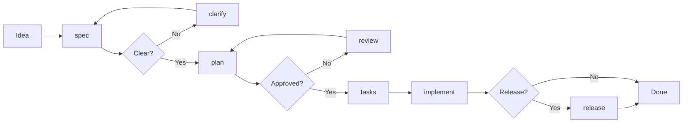

# Cortex AI

[](https://github.com/RikaiDev/cortex/releases)
[](LICENSE)
[](https://modelcontextprotocol.io)
[](#-tool-categories)

[English](README.md) | [繁體中文](README.zh-TW.md) | [Documentation](docs/)

---

## The Problem with AI Coding Assistants

AI coding assistants like **Claude Code**, **Cursor**, and **GitHub Copilot** are powerful, but they share critical limitations:

| Limitation | Impact |
|------------|--------|
| **No Memory** | Every session starts fresh. Past decisions, patterns, and lessons are forgotten. |
| **No Structure** | Responses vary wildly. Same prompt → different quality each time. |
| **No Validation** | No quality gates. AI can generate incomplete or inconsistent code. |
| **No Impact Awareness** | AI doesn't understand how changes affect the rest of your codebase. |
| **No Team Knowledge** | Each developer's learnings stay siloed. No shared intelligence. |
| **No Principles** | No way to enforce coding standards across sessions. |

**Result**: Unpredictable "vibe coding" that requires constant human oversight.

---

## The Solution: Cortex AI

**Cortex AI** is a development brain that extends any MCP-compatible AI assistant with **memory, structure, and intelligence**.

```
┌─────────────────────────────────────────────────────────────────┐
│                    Your AI Assistant                            │
│              (Claude Code / Cursor / Copilot)                   │
└─────────────────────────┬───────────────────────────────────────┘
                          │ MCP Protocol
                          ▼
┌─────────────────────────────────────────────────────────────────┐
│                      CORTEX AI                                  │
│  ┌──────────────┐ ┌──────────────┐ ┌──────────────┐            │
│  │   Memory     │ │  Workflows   │ │   Analysis   │            │
│  │   System     │ │   System     │ │   Engine     │            │
│  │              │ │              │ │              │            │
│  │ • Patterns   │ │ • Spec       │ │ • Security   │            │
│  │ • Decisions  │ │ • Plan       │ │ • Quality    │            │
│  │ • Lessons    │ │ • Tasks      │ │ • Impact     │            │
│  │ • Solutions  │ │ • Implement  │ │ • Coverage   │            │
│  └──────────────┘ └──────────────┘ └──────────────┘            │
│  ┌──────────────┐ ┌──────────────┐ ┌──────────────┐            │
│  │    Team      │ │ Constitution │ │ Environment  │            │
│  │  Knowledge   │ │   Engine     │ │  Awareness   │            │
│  └──────────────┘ └──────────────┘ └──────────────┘            │
└─────────────────────────────────────────────────────────────────┘
```

---

## What Cortex AI Adds to Your AI Assistant

### 1. Persistent Memory
Your AI finally remembers. Patterns, decisions, solutions, and lessons persist across sessions.

```bash
# AI learns from this session
learn "Use React Query for server state, Zustand for client state"

# Months later, AI recalls this automatically
context "state management"
# → Returns: "Previously decided: React Query for server state..."
```

### 2. Structured Workflows
Transform chaos into predictable delivery with phase-based development.

```
spec → clarify → plan → review → tasks → implement → release
         │          │          │           │
         └──────────┴──────────┴───────────┘
              User confirmation at each gate
```

### 3. Impact Analysis
AI understands your codebase structure before making changes.

```bash
impact-analyze files:["src/auth/service.ts"]
# → 23 files affected
# → 2 breaking changes detected
# → Risk level: HIGH
# → Suggestions: Update dependents first...
```

### 4. Code Intelligence (72 Tools)
Security scanning, quality analysis, test coverage, architecture validation—all built-in.

```bash
security-scan path:"src/"           # Find vulnerabilities
quality-analyze path:"src/"         # Detect code smells
test-suggest path:"src/services/"   # Suggest missing tests
arch-validate                       # Check architecture rules
```

### 5. Team Knowledge
Share learnings across your team. No more rediscovering solved problems.

```bash
team-share-insight "API rate limiting pattern for external services"
team-view-insights type:"pattern"
team-resolve-conflict  # When team members disagree
```

### 6. Constitution-Driven Development
Define your project's principles once. Every AI response respects them.

```markdown
<!-- .cortex/constitution.md -->
## Principles
- All functions must have JSDoc comments
- No console.log in production code
- Tests required for all public APIs
- Maximum file size: 300 lines
```

---

## Quick Start

### 1. Install

```bash
npm install -g @rikaidev/cortex
```

### 2. Connect to Your AI Assistant

**Claude Code:**
```bash
claude mcp add cortex -- npx -y @rikaidev/cortex@latest start
```

**Cursor:**
```json
// .cursor/mcp.json
{
  "mcpServers": {
    "cortex": {
      "command": "npx",
      "args": ["-y", "@rikaidev/cortex@latest", "start"]
    }
  }
}
```

### 3. Initialize Your Project

```bash
cd your-project
cortex init
```

### 4. Start Building

```bash
# In your AI assistant
spec "Add user authentication with OAuth"
```

---

## Tool Categories

Cortex provides **72 specialized tools** across 16 categories:

| Category | Tools | Purpose |
|----------|-------|---------|
| **Workflow** | `spec` `clarify` `plan` `review` `tasks` `implement` `status` `list` | Structured feature development |
| **Memory** | `learn` `context` `correct` | Persistent knowledge management |
| **Impact Analysis** | `impact-analyze` `impact-preview` `impact-validate` `impact-stats` `impact-build-graph` | Change impact assessment |
| **Code Quality** | `quality-analyze` `quality-complexity` `quality-duplicates` `quality-refactor` | Code smell detection |
| **Security** | `security-scan` `security-detect-secrets` `security-check-deps` | Vulnerability scanning |
| **Test Coverage** | `test-analyze` `test-quality` `test-suggest` `test-untested` | Test gap identification |
| **Architecture** | `arch-validate` `arch-check` `arch-suggest` | Pattern validation |
| **Documentation** | `doc-analyze` `doc-validate` `doc-missing` `doc-generate` | Documentation quality |
| **CI/CD** | `ci-status` `ci-failures` `ci-validate` `ci-history` | Pipeline analysis |
| **Dependencies** | `dependency-analyze` `dependency-check` `dependency-suggest` `dependency-version` | Dependency health |
| **Performance** | `performance-analyze` `performance-*-pattern` | Anti-pattern detection |
| **Environment** | `environment-detect` `environment-add` `environment-list` `environment-check` `environment-remove` | Runtime constraints |
| **Team** | `team-share-insight` `team-view-insights` `team-learn-pr` `team-*-conflict` `team-stats` `team-sync` | Team collaboration |
| **PR Review** | `pr-auto-review` `pr-checklist` `pr-suggest-reviewers` | Pull request analysis |
| **Checkpoint** | `checkpoint-save` `checkpoint-list` `checkpoint-resume` `checkpoint-clear` | Workflow snapshots |
| **Project** | `constitution` `onboard` `release` `mark-danger` `unmark-danger` `list-dangers` | Project management |

---

## The Workflow System

### From Idea to Implementation



### Example Session

```bash
# 1. Define what you're building
> spec "Add real-time notifications with WebSocket"
✓ Created workflow: 001-realtime-notifications
✓ Generated: spec.md, checklists/requirements.md

# 2. Clarify ambiguities (AI asks targeted questions)
> clarify
? Should notifications persist when user is offline?
> Yes, queue and deliver on reconnect
✓ Updated: spec.md

# 3. Create technical plan
> plan
✓ Generated: plan.md, CONTEXT.md, checklists/design.md
✓ Memory updated with tech stack decisions

# 4. Break into tasks
> tasks
✓ Generated: tasks.md, checklists/tasks.md
✓ Identified 3 parallelizable task groups

# 5. Implement
> implement
✓ Pre-checks: .gitignore validated, dependencies checked
✓ Executing tasks with quality validation...
✓ Learning extracted and stored

# 6. Release
> release
✓ Analyzed: 12 commits, 3 workflows
✓ Generated: CHANGELOG.md, RELEASE_NOTES.md
```

---

## Why This Matters

### Before Cortex AI

```
Developer: "Add authentication"
AI: *generates code*
Developer: "Wait, that's inconsistent with our patterns"
AI: *generates different code*
Developer: "You broke the user service"
AI: "I don't see how they're connected"
Developer: *sighs, fixes manually*
```

### After Cortex AI

```
Developer: "Add authentication"

Cortex:
├─ Memory: "Auth pattern from project X uses JWT + refresh tokens"
├─ Impact: "Will affect: UserService, SessionMiddleware, 12 routes"
├─ Constitution: "Must include rate limiting per project rules"
├─ Security: "Checking for common auth vulnerabilities..."
└─ Quality: "Generating with test coverage requirements"

AI: *generates consistent, validated, impact-aware code*
```

---

## Project Structure

```
.cortex/
├── constitution.md          # Your project's principles
├── memory/
│   └── index.json          # Persistent knowledge store
├── templates/              # Workflow templates
│   └── commands/           # AI execution guides
└── workflows/
    └── 001-feature/        # Individual workflows
        ├── spec.md
        ├── plan.md
        ├── tasks.md
        └── checklists/     # Auto-generated validations
```

---

## Compared to Other Solutions

| Feature | Cortex AI | Plain AI | Custom Prompts | Other Tools |
|---------|-----------|----------|----------------|-------------|
| Persistent Memory | ✅ | ❌ | ❌ | Partial |
| Structured Workflows | ✅ | ❌ | Manual | ❌ |
| Impact Analysis | ✅ | ❌ | ❌ | Limited |
| Security Scanning | ✅ | ❌ | ❌ | Separate tool |
| Team Knowledge | ✅ | ❌ | ❌ | ❌ |
| Quality Gates | ✅ | ❌ | Manual | ❌ |
| Multi-Platform | ✅ (MCP) | Varies | Varies | Varies |
| Zero Config | ✅ | ✅ | ❌ | ❌ |

---

## Philosophy

### Template + Command = Stable Output

Inspired by [GitHub's spec-kit](https://github.com/github/spec-kit), Cortex ensures predictable AI output through structured templates and execution commands.

### Constitution-Driven Development

Every AI response is validated against your project's principles. No more style guide violations or pattern inconsistencies.

### Learn Once, Remember Forever

Every decision, pattern, and lesson is captured. Your AI gets smarter with every session.

### User Control at Every Gate

AI proposes, human approves. Mandatory checkpoints prevent runaway code generation.

---

## Requirements

- Node.js 18+
- MCP-compatible AI assistant (Claude Code, Cursor, or any MCP client)

---

## Contributing

We welcome contributions! See [CONTRIBUTING.md](CONTRIBUTING.md).

---

## License

MIT License - see [LICENSE](LICENSE).

---

## Links

- [Documentation](docs/)
- [GitHub Issues](https://github.com/RikaiDev/cortex/issues)
- [Changelog](CHANGELOG.md)

---

<p align="center">
  <strong>Stop vibe coding. Start building with intelligence.</strong>
</p>
