# Cortex AI

[](https://github.com/RikaiDev/cortex/releases)
[](LICENSE)
[](https://nodejs.org/)

[English](README.md) | [繁體中文](README.zh-TW.md) | [Documentation](docs/) | [Changelog](CHANGELOG.md)

## 🧠 AI Collaboration Brain

**Cortex AI** is an intelligent AI collaboration system that transforms AI models into reliable, learning partners.
It solves the fundamental problems of AI inconsistency and lack of memory through **prompt injection** and **real-time preference learning**.

### 🎯 **Core Mission**

To create consistent, personalized, and continuously improving AI collaboration experiences that adapt to individual developers and project needs,
eliminating the frustration of repetitive explanations and inconsistent AI behavior.

### 🎯 **Why Cortex?**

**The Problem:**

- AI models behave inconsistently across different platforms
- AI forgets user preferences and coding patterns
- Repetitive explanations of the same project conventions
- Lack of personalization in AI collaboration
- No memory of successful interaction patterns

**The Solution:**

- **🧠 Consistent AI Behavior** - Standardized thinking processes across all AI platforms
- **📚 Learning Memory** - Remembers user preferences and project patterns
- **🔄 Continuous Adaptation** - Evolves based on successful interactions
- **🎯 Context Awareness** - Understands project-specific conventions and workflows

### 🏗️ **Architecture**

Cortex AI uses a multi-layered architecture for intelligent AI collaboration:

```text
🧠 Brain Layer (AI Platform Integration)
├── MCP Server - Unified protocol interface
├── Multi-Role Workflows - Structured task execution
├── Real-time Learning - User preference memory
└── Cross-platform Consistency - Unified behavior

📚 Experience Layer (.cortex directory)
├── Invisible project configuration
├── User preference learning
├── Project pattern recognition
└── Continuous improvement

🛠️ Essential Tools
├── MCP tools system - Rich feature set
├── Resource management - Project snapshots
├── Prompt templates - Structured thinking
└── CLI interface - Simplified operations
```

> **📖 [Detailed Architecture Guide](docs/architecture.md)** - Complete system architecture and technical details

### 🧠 **Core Principles** - The Ingenious Design Philosophy

**Cortex AI** implements revolutionary principles that transform AI collaboration through architectural brilliance:

1. **🔮 Few-Shot to Fine-Tune Transformation** - **The Alchemical Process**: We don't just use few-shot examples - we *transmute* them.
A simple user instruction like *"write comments in English"* becomes a comprehensive, production-ready prompt system that enforces this preference across all future interactions.
This isn't learning - it's systematic transformation.

2. **🪝 Hook-Based Interception System** - **The Invisible Conductor**: Every single user input is intercepted before reaching the AI model.
We don't wait for AI responses - we *shape* them.
This architectural sleight-of-hand ensures that no matter which AI model you use (Cursor, Claude, Gemini), they all behave consistently because we've already predetermined the outcome.

3. **⚙️ Deterministic Expansion Over Randomness** - **The Clockwork Mind**: We reject the "emergent behavior" fallacy.
Instead of hoping AI will "figure it out," we systematically expand minimal inputs into complete, well-structured instructions.
When you say *"fix the bug,"* we don't hope the AI understands - we *tell* it exactly what to do, how to do it, and why.

4. **🔒 Guaranteed Processing Pipeline** - **The Unbreakable Chain**: Every input goes through our complete pipeline with 100% execution rate.
No step is ever skipped, no process is ever bypassed.
This isn't reliability - it's *architectural inevitability*. The system cannot fail to apply your preferences because failure is literally impossible.

5. **📋 Explicit Reasoning and Documentation** - **The Transparent Brain**: Every transformation is logged, every decision is documented, every preference change is traceable.
You can literally see how *"use TypeScript"* becomes a system-wide directive that affects every code suggestion, every comment, every response.

This philosophy creates an intelligent system that doesn't just respond - it *evolves with you*,
learning your patterns and preferences through systematic, deterministic transformation of your intent into perfect execution, moving beyond trial and error approaches.

**The Result?** Simple inputs become comprehensive, personalized AI experiences.
*"Don't use async/await"* becomes a universal rule that shapes every code suggestion, every refactoring, every architectural decision.

#### MCP Workflow Architecture - The Architectural Masterpiece

This diagram reveals the ingenious design that makes Cortex AI truly unique:

```mermaid
graph TD
    A[User Input] --> B[AI Platform Processing]
    B --> C[MCP Protocol Layer]
    C --> D[Intelligent Workflow]
    D --> E[Task Analysis & Planning]
    E --> F[Role Collaboration Execution]
    F --> G[Result Integration Output]

    subgraph "The Three Pillars of Genius"
        C
        H[🪝 Interception Architecture - Every input is caught and shaped]
        I[🔮 Transformation Engine - Simple → Sophisticated]
        J[⚙️ Deterministic Pipeline - Predictable perfection]
    end

    H -.-> C
    I -.-> C
    J -.-> C
```



**The Hidden Brilliance:**
- **Interception Point (C)**: The pivotal moment where raw user input becomes orchestrated intelligence
- **Transformation Flow**: Watch how *"fix the bug"* becomes a multi-step symphony of analysis, planning, and execution
- **Guaranteed Outcome**: Every path leads to the same destination - your preferences perfectly applied

#### MCP Processing Sequence - The Choreographed Intelligence

This sequence diagram unveils the intricate dance of intelligence transformation:


**The Choreographic Brilliance:**
- **Rule Loading (Step 2)**: Before any AI processing, we load your personalized rules
- **Interception Point (Step 4)**: The critical moment where raw input becomes structured intelligence
- **Workflow Orchestration (Steps 5-10)**: A symphony of analysis, decomposition, and role assignment
- **Result Injection (Step 12)**: The final transformation where structured thinking becomes natural response

**Why This Matters:** This isn't just processing - it's a deterministic transformation where *"help me code"* becomes a multi-step, multi-role collaboration that respects every preference you've ever expressed.

## ✨ **Core Features**

### **🧠 MCP Protocol Support**

**Cortex AI** fully supports MCP (Model Context Protocol), providing rich tools, resources, and prompt systems that build upon our core principles:

#### **🛠️ MCP Tools**

| Tool Name | Description | Purpose |
|-----------|-------------|---------|
| `cortex-task` | Create and execute complete AI collaboration workflows | Launch multi-role collaboration for complex development tasks |
| `execute-workflow-role` | Execute the next role in a workflow | Continue ongoing workflow execution |
| `submit-role-result` | Submit AI-processed results back to workflow | Complete role tasks and pass results |
| `get-workflow-status` | Get workflow status and progress | Track workflow execution status |
| `list-workflows` | List all available workflows | View project workflow list |
| `create-pull-request` | Create pull requests for workflow results | Automate PR creation process |

#### **📚 MCP Resources**

| Resource URI | Name | Description | Format |
|-------------|------|-------------|--------|
| `cortex://workflows` | Cortex Workflows | List of all Cortex AI workflows | JSON |
| `cortex://workflows/{id}/handoff` | Workflow Handoff | Handoff document for specific workflow | Markdown |
| `cortex://workflows/{id}/pr` | Workflow PR | Pull request document for specific workflow | Markdown |
| `cortex://snapshots/project` | Project Snapshot | Current project structure and architecture snapshot | JSON |
| `cortex://snapshots/{id}` | Workflow Snapshot | Workflow execution and decision snapshot | JSON |
| `cortex://project/tasks` | Project Tasks | Development tasks from .vscode/tasks.json | JSON |
| `cortex://ide/integration-guide` | IDE Integration Guide | Cortex AI IDE integration setup guide | Markdown |

#### **💬 MCP Prompts**

| Prompt Name | Description | Parameters |
|-------------|-------------|------------|
| `workflow-role-analysis` | Generate structured analysis for roles in workflows | `roleId`, `workflowId` |
| `technical-code-review` | Generate technical code review and assessment | `codebase`, `requirements`, `role` |
| `workflow-progress-summary` | Generate workflow progress and decision summaries | `workflowId`, `includeTechnicalDetails` |

### **🔄 Multi-Role Workflows**

**Cortex AI** supports multi-role collaboration patterns, with each role focusing on specific domains:

- **🏗️ Architecture Designer** - System architecture design and decisions
- **💻 Code Assistant** - Code writing and quality assurance
- **📝 Documentation Specialist** - Documentation writing and maintenance
- **🔒 Security Specialist** - Security review and best practices
- **🧪 Testing Specialist** - Testing strategy and implementation
- **🎨 UI/UX Designer** - User experience design
- **⚛️ React Expert** - React ecosystem expertise

Each role has specialized templates and guidelines ensuring professionalism and consistency.

### **📚 Enhanced Learning System**

Our core principles enable advanced learning capabilities:

- **User Preference Detection** - Learns from keywords like "wrong", "we use", "don't"
- **Immediate Application** - Applies learned preferences to current responses
- **No Error Repetition** - Never repeats corrected mistakes
- **Frustration Detection** - Identifies and learns from user frustration

### **🔄 Cross-Platform Consistency**

- **Cursor Integration** - Enhanced MDC with preference learning
- **Claude Support** - Context-aware system messages
- **Gemini Support** - Platform-specific prompt engineering
- **Unified Behavior** - Same learning and thinking across all platforms

## 🚀 **Quick Start**

### **Simple Task Execution (Recommended)**

Execute a complete development task with AI collaboration in one command:

```bash
# Execute a development task with full AI workflow
npx @rikaidev/cortex@latest task "Implement user authentication system with registration, login, and password reset"

# With PR options
npx @rikaidev/cortex@latest task "Add dark mode toggle to settings page" --draft-pr --base-branch develop
```

**Automatic execution flow:**

1. 🧠 **Context Enhancement** - Uses MCP tools to find relevant past experiences
2. 📝 **Workflow Creation** - Creates structured multi-role workflows
3. 🎭 **Role Execution** - Executes each role task in sequence
4. 📚 **Experience Recording** - Records learning for future tasks
5. 🚀 **PR Creation** - Generates complete PR documentation and creates GitHub PR

### **Installation**

```bash
# Direct execution via npx (recommended)
npx @rikaidev/cortex@latest

# Or global installation
npm install -g @rikaidev/cortex
```

> **Note**: Using `@rikaidev/cortex@latest` ensures you always get the latest version without manual updates.

### **MCP Client Configuration**

Add the following config to your MCP client:

```json
{
  "mcpServers": {
    "cortex-ai": {
      "command": "npx",
      "args": ["-y", "@rikaidev/cortex@latest", "start"]
    }
  }
}
```

#### **Supported MCP Clients**

**Claude Code**
```bash
claude mcp add cortex-ai npx -y @rikaidev/cortex@latest start
```

**Cursor**
- Go to `Cursor Settings` → `MCP` → `New MCP Server`
- Use the config provided above

**VS Code**
```bash
code --add-mcp '{"name":"cortex-ai","command":"npx","args":["-y","@rikaidev/cortex@latest","start"]}'
```

### **Project Initialization**

```bash
# Initialize Cortex workspace structure and IDE integration
npx @rikaidev/cortex@latest init

# Or skip IDE integration if you only want workspace setup
npx @rikaidev/cortex@latest init --skip-ide
```

### **Workspace Structure**

Cortex creates isolated workspaces for each workflow:

```text
.cortex/
├── .cortexrc              # Configuration file
├── workflows/             # Workflow state files
├── workspaces/            # Individual workspace folders (hash-based)
│   └── abc12345/          # Unique workspace for each workflow
│       ├── handoff.md     # Role handoff documentation
│       └── pr.md          # Pull request description
└── roles/                 # Role definitions
```

## 📚 **Documentation**

- **[Getting Started](docs/getting-started.md)** - Quick setup guide
- **[Architecture](docs/architecture.md)** - System architecture details
- **[Code Patterns](docs/code-patterns.md)** - Code style guidelines
- **[Changelog](CHANGELOG.md)** - Complete change history
- **[Roadmap](ROADMAP.md)** - Future development plans

## 🛠️ **Development**

### **Prerequisites**

- Node.js 18+
- TypeScript knowledge

### **Setup**

```bash
# Clone repository
git clone https://github.com/RikaiDev/cortex.git
cd cortex

# Install dependencies
npm install

# Build project
npm run build

# Run code quality checks
npm run quality

# Run tests
npm run test

# Start development
npm run dev
```

### **Contributing**

- [Contributing Guidelines](CONTRIBUTING.md)
- [Code of Conduct](CODE_OF_CONDUCT.md)
- [Development Setup](docs/development/)

## 🎯 **Why "Cortex"?**

**Cortex (大腦皮質)** represents the brain's advanced cognitive functions:

- **🧠 Thinking** - Structured reasoning and problem-solving
- **📚 Memory** - Learning and storing experiences
- **🔄 Evolution** - Continuous improvement through experience
- **🎯 Decision** - Making informed choices based on learning

Just like the human cerebral cortex, **Cortex AI** is the "brain" for AI systems - responsible for thinking, memory, learning, and decision-making.

---

**Transform your AI interactions from frustrating repetitions to intelligent, learning partnerships with Cortex AI.**
