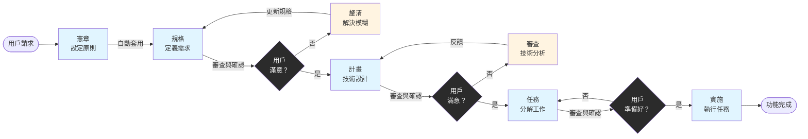

# Cortex AI

[](https://github.com/RikaiDev/cortex/releases)
[](LICENSE)
[](https://nodejs.org/)

[English](README.md) | [繁體中文](README.zh-TW.md) | [文檔](docs/) | [更新日誌](CHANGELOG.md)

## Cortex AI 是什麼？

**Cortex AI** 是一個穩定、結構化的開發工作流程系統，將 AI 輔助開發從不可預測的「憑感覺編碼」轉變為可靠、品質導向的功能交付。

基於 **MCP (Model Context Protocol)**，Cortex 提供 **憲章驅動、模板化工作流程**，確保無論您使用哪個 AI 模型（Cursor、Claude、Copilot 或其他），都能獲得一致的輸出。

### 問題

傳統的 AI 輔助開發面臨：
- **輸出品質不可預測** - AI 每次生成不同結果
- **沒有品質把關** - 功能建構缺乏驗證檢查點
- **結構不一致** - 每個開發者得到不同的文件結構
- **AI 失控** - AI 持續運作而不確認，產生不需要的變更

### 解決方案

Cortex AI 引入 **穩定工作流程系統**：
- **模板 + 命令架構** - 結構化模板與 AI 執行指導
- **憲章驅動驗證** - 每個階段根據專案原則檢查
- **強制用戶檢查點** - 進入下一階段前明確確認
- **自動品質驗證** - 內建檢查清單和技術棧檢測

---

## ⚡ 快速開始

### 1. 安裝 Cortex

```bash
# 全域安裝
npm install -g @rikaidev/cortex

# 或使用 npx（無需安裝）
npx @rikaidev/cortex init
```

### 2. 初始化專案

```bash
cd your-project
cortex init
```

這會建立 `.cortex/` 目錄，包含模板、憲章和工作流程結構。

### 3. 設定 MCP 客戶端

**Cursor:**
```json
{
  "mcpServers": {
    "cortex-ai": {
      "command": "npx",
      "args": ["-y", "@rikaidev/cortex@latest", "start"]
    }
  }
}
```

**Claude Code:**
```bash
claude mcp add cortex npx -y @rikaidev/cortex@latest start
```

### 4. 開始第一個功能

```bash
# 在您的 AI 助理中
cortex spec "新增使用電子郵件和密碼的用戶驗證"
```

輸出：工作流程 `001-add-user-auth` 已建立

### 5. 遵循工作流程

```bash
# 可選：釐清模糊之處
cortex clarify 001-add-user-auth

# 生成實施計畫
cortex plan 001-add-user-auth

# 可選：技術審查
cortex review 001-add-user-auth

# 分解為任務
cortex tasks 001-add-user-auth

# 執行實施
cortex implement 001-add-user-auth
```

---

## 📊 工作流程視覺化



**圖例：**
- 🔵 **藍色方框** - AI 執行階段
- 🟡 **黃色方框** - 可選用戶互動階段
- ⚫ **黑色菱形** - 用戶決策檢查點

---

## 🔧 可用命令

| 命令 | 描述 | 自動動作 | 用戶確認 |
|------|------|----------|---------|
| `cortex.constitution` | 建立/更新專案原則 | 自動套用到所有階段 | 否 |
| `cortex.spec` | 定義功能需求 | 生成需求檢查清單 | 是 - 計畫前 |
| `cortex.clarify` | 解決規格模糊 | 更新 spec.md，儲存 clarifications.md | 是 - 迭代問答 |
| `cortex.plan` | 建立技術實施計畫 | 更新 CONTEXT.md，生成設計檢查清單 | 是 - 任務前 |
| `cortex.review` | 執行計畫技術審查 | 儲存 review.md 與行動項目 | 是 - 批准/修改 |
| `cortex.tasks` | 將計畫分解為可執行任務 | 生成任務檢查清單 | 是 - 實施前 |
| `cortex.implement` | 執行角色協調實施 | 驗證 gitignore，生成實施檢查清單，執行任務 | 進度監控 |
| `cortex.status` | 檢查工作流程狀態和進度 | - | 否 |
| `cortex.list` | 列出所有工作流程 | - | 否 |
| `cortex.learn` | 提取經驗教訓到記憶 | 更新記憶索引 | 否 |
| `cortex.context` | 從記憶增強上下文 | - | 否 |

---

## 🤖 內建自動化

| 階段 | 自動動作 | 觸發時機 | 輸出文件 |
|------|---------|---------|---------|
| **規格** | 需求檢查清單生成 | spec.md 建立後 | `checklists/requirements.md` |
| **計畫** | 上下文記憶更新, 設計檢查清單生成 | plan.md 建立後 | `CONTEXT.md`, `checklists/design.md` |
| **任務** | 任務檢查清單生成 | tasks.md 建立後 | `checklists/tasks.md` |
| **實施** | Gitignore 驗證, 實施檢查清單, 技術棧檢測 | 執行開始前 | `.gitignore`（更新）, `checklists/implementation.md` |

**無需手動工具呼叫** - 這些驗證和檢查會在正確的工作流程點自動執行。

---

## 📚 核心理念

| 原則 | 描述 | 好處 |
|------|------|------|
| **模板 + 命令 = 穩定輸出** | 模板提供結構（佔位符），命令指導 AI 執行 | 所有 AI 模型都能獲得一致、可預測的結果 |
| **憲章驅動開發** | 每個階段根據專案原則驗證 | 在整個開發過程中維持品質和一致性 |
| **用戶確認檢查點** | 規格、計畫和任務後強制暫停 | 防止 AI 失控，確保與意圖一致 |
| **漸進式品質驗證** | 每個階段自動生成檢查清單 | 及早發現問題，維持品質把關 |

---

## 🏗️ 架構

Cortex AI 使用 **基於 MCP 的多層架構**：

```
AI 平台 (Cursor/Claude/Copilot)
         ↓
    MCP 協定
         ↓
  穩定工作流程處理器 ← 憲章驗證器
         ↓                ← 模板生成器
    服務層：              ← 工作流程服務
    ├─ GitignoreValidator
    ├─ ContextManager
    └─ ChecklistGenerator
         ↓
  .cortex/ 文件結構
```

**關鍵元件：**
- **StableWorkflowHandler** - 協調所有工作流程階段
- **模板系統** - 結構化模板 + 執行命令
- **服務層** - 自動化驗證和品質檢查
- **憲章** - 專案特定原則和規則

詳細架構和技術規格，請參見 [架構文檔](docs/architecture.md)。

---

## 📖 了解更多

- **[架構](docs/architecture.md)** - 系統元件技術深入探討
- **[快速入門](docs/getting-started.md)** - 完整教學與範例
- **[程式碼模式](docs/code-patterns.md)** - 開發指南和最佳實務

---

## 🎯 範例工作流程

```bash
# 步驟 1：初始化
cortex init

# 步驟 2：建立規格（AI 生成結構化規格）
cortex spec "建立具有看板的任務管理系統"
# → 輸出：001-task-management 已建立

# 步驟 3：釐清（可選 - AI 問有針對性的問題）
cortex clarify 001-task-management
# AI：「任務是否應支援子任務？」
# 您：「是的，最多 2 層深度」
# → spec.md 使用釐清內容更新

# 步驟 4：生成計畫（AI 建立技術設計）
cortex plan 001-task-management
# → 自動：
#   - CONTEXT.md 使用技術棧更新
#   - checklists/design.md 生成

# 步驟 5：審查（可選 - 技術分析）
cortex review 001-task-management
# → AI 執行 6 類別審查：
#   架構、安全、效能等。

# 步驟 6：分解任務
cortex tasks 001-task-management
# → 自動：
#   - checklists/tasks.md 生成
#   - 任務標記為可並行執行

# 步驟 7：實施
cortex implement 001-task-management
# → 自動：
#   - .gitignore 根據技術棧驗證
#   - checklists/implementation.md 生成
#   - 任務依正確順序執行
```

---

## 🌟 主要功能

### ✅ 品質優先

- 每個階段都包含驗證檢查點
- 憲章原則自動執行
- 自動生成檢查清單確保完整性

### ✅ 可預測輸出

- 基於模板的結構保證一致性
- 同一工作流程在不同 AI 模型產生相同品質
- 沒有「憑感覺編碼」- 每一步都是有意的

### ✅ 用戶控制

- 重要階段轉換前強制確認
- 可選的釐清和審查步驟
- 完全可見 AI 生成的內容

### ✅ 智能自動化

- 技術棧檢測和 gitignore 驗證
- 上下文記憶追蹤專案演化
- 可能時並行執行任務

### ✅ 學習系統

- 從完成的工作流程提取經驗教訓
- 記憶系統儲存成功模式
- 憲章隨專案需求演化

---

## 🛠️ CLI 命令

```bash
# 階段命令（使用 cortex.spec 的工作流程 ID）
cortex spec "<描述>"       # 建立規格
cortex clarify <workflow-id>      # 釐清模糊
cortex plan <workflow-id>         # 生成計畫
cortex review <workflow-id>       # 技術審查
cortex tasks <workflow-id>        # 分解任務
cortex implement <workflow-id>    # 執行實施

# 狀態命令
cortex status <workflow-id>       # 檢查進度
cortex list                       # 列出所有工作流程
cortex list --limit 5             # 限制結果

# 學習命令
cortex learn <workflow-id>        # 提取教訓
cortex context <查詢>            # 搜尋記憶

# 實用命令
cortex init                       # 初始化專案
cortex init --skip-ide            # 跳過 IDE 整合
```

---

## 📋 專案結構

執行 `cortex init` 後，您的專案將有：

```
.cortex/
├── constitution.md              # 專案原則
├── memory/
│   └── index.json              # 經驗索引
├── templates/
│   ├── constitution.md         # 憲章模板
│   ├── spec-template.md        # 規格模板
│   ├── clarify-template.md     # 釐清模板
│   ├── plan-template.md        # 計畫模板
│   ├── review-template.md      # 審查模板
│   ├── tasks-template.md       # 任務模板
│   └── commands/               # AI 執行指南
│       ├── constitution.md
│       ├── spec.md
│       ├── clarify.md
│       ├── plan.md
│       ├── review.md
│       ├── tasks.md
│       └── implement.md
└── workflows/
    └── 001-feature-name/       # 個別工作流程
        ├── spec.md
        ├── clarifications.md   # 如使用 clarify
        ├── plan.md
        ├── CONTEXT.md          # 自動生成
        ├── review.md           # 如使用 review
        ├── tasks.md
        ├── checklists/         # 自動生成
        │   ├── requirements.md
        │   ├── design.md
        │   ├── tasks.md
        │   └── implementation.md
        └── execution/          # 實施日誌
```

---

## 🤝 貢獻

我們歡迎貢獻！請參見 [CONTRIBUTING.md](CONTRIBUTING.md) 了解指南。

---

## 📄 授權

MIT License - 詳情請見 [LICENSE](LICENSE)。

---

## 🙏 致謝

受 [spec-kit](https://github.com/github/spec-kit) 啟發 - GitHub 的 Spec-Driven Development 工具包。

我們採用了 spec-kit 出色的 **模板 + 命令 = 穩定輸出** 方法，並整合到 Cortex AI 既有的：
- MCP 協定整合以支援跨平台 AI
- 多角色協調系統
- 憲章驅動驗證
- 學習記憶系統以持續改進

---

## 💬 支援

- **文檔**：[docs/](docs/)
- **問題**：[GitHub Issues](https://github.com/RikaiDev/cortex/issues)
- **討論**：[GitHub Discussions](https://github.com/RikaiDev/cortex/discussions)
