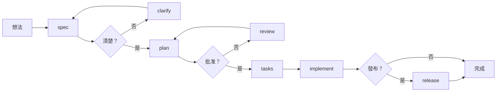

# Cortex AI

[](https://github.com/RikaiDev/cortex/releases)
[](LICENSE)
[](https://modelcontextprotocol.io)
[](#-工具分類)

[English](README.md) | [繁體中文](README.zh-TW.md) | [文檔](docs/)

---

## AI 編程助手的問題

**Claude Code**、**Cursor**、**GitHub Copilot** 等 AI 編程助手功能強大，但它們有共同的致命缺陷：

| 限制 | 影響 |
|------|------|
| **沒有記憶** | 每次對話都從零開始。過去的決策、模式、經驗教訓全部遺忘。 |
| **沒有結構** | 輸出品質不穩定。同樣的 prompt → 每次結果都不同。 |
| **沒有驗證** | 沒有品質把關。AI 可能產生不完整或不一致的程式碼。 |
| **不了解影響** | AI 不知道變更會如何影響程式碼庫的其他部分。 |
| **無法共享知識** | 每個開發者的學習各自獨立。沒有團隊智慧。 |
| **沒有原則約束** | 無法跨對話強制執行編碼標準。 |

**結果**：需要持續人工監督的「憑感覺編碼」。

---

## 解決方案：Cortex AI

**Cortex AI** 是一個開發大腦，為任何 MCP 相容的 AI 助手擴展 **記憶、結構和智慧**。

```
┌─────────────────────────────────────────────────────────────────┐
│                    您的 AI 助手                                  │
│              (Claude Code / Cursor / Copilot)                   │
└─────────────────────────┬───────────────────────────────────────┘
                          │ MCP 協定
                          ▼
┌─────────────────────────────────────────────────────────────────┐
│                      CORTEX AI                                  │
│  ┌──────────────┐ ┌──────────────┐ ┌──────────────┐            │
│  │   記憶       │ │   工作流程   │ │   分析       │            │
│  │   系統       │ │   系統       │ │   引擎       │            │
│  │              │ │              │ │              │            │
│  │ • 模式       │ │ • 規格       │ │ • 安全       │            │
│  │ • 決策       │ │ • 計畫       │ │ • 品質       │            │
│  │ • 經驗       │ │ • 任務       │ │ • 影響       │            │
│  │ • 解決方案   │ │ • 實施       │ │ • 覆蓋率     │            │
│  └──────────────┘ └──────────────┘ └──────────────┘            │
│  ┌──────────────┐ ┌──────────────┐ ┌──────────────┐            │
│  │    團隊      │ │   憲章       │ │   環境       │            │
│  │   知識庫     │ │   引擎       │ │   感知       │            │
│  └──────────────┘ └──────────────┘ └──────────────┘            │
└─────────────────────────────────────────────────────────────────┘
```

---

## Cortex AI 為您的 AI 助手增加什麼

### 1. 持久化記憶
您的 AI 終於能記住了。模式、決策、解決方案和經驗教訓跨對話持久保存。

```bash
# AI 從這次對話學習
learn "伺服器狀態用 React Query，客戶端狀態用 Zustand"

# 幾個月後，AI 自動回憶
context "狀態管理"
# → 返回："之前決定：伺服器狀態用 React Query..."
```

### 2. 結構化工作流程
透過階段式開發，將混亂轉變為可預測的交付。

```
spec → clarify → plan → review → tasks → implement → release
         │          │          │           │
         └──────────┴──────────┴───────────┘
              每個關卡都需要用戶確認
```

### 3. 影響分析
AI 在做變更前先了解您的程式碼庫結構。

```bash
impact-analyze files:["src/auth/service.ts"]
# → 影響 23 個檔案
# → 偵測到 2 個破壞性變更
# → 風險等級：高
# → 建議：先更新依賴方...
```

### 4. 程式碼智慧（72 個工具）
安全掃描、品質分析、測試覆蓋率、架構驗證——全部內建。

```bash
security-scan path:"src/"           # 找出漏洞
quality-analyze path:"src/"         # 偵測程式碼異味
test-suggest path:"src/services/"   # 建議缺少的測試
arch-validate                       # 檢查架構規則
```

### 5. 團隊知識
跨團隊分享學習成果。不再重複解決已解決的問題。

```bash
team-share-insight "外部服務的 API 限流模式"
team-view-insights type:"pattern"
team-resolve-conflict  # 當團隊成員意見不同時
```

### 6. 憲章驅動開發
定義一次專案原則。每個 AI 回應都遵守它們。

```markdown
<!-- .cortex/constitution.md -->
## 原則
- 所有函數必須有 JSDoc 註解
- 生產程式碼禁止 console.log
- 所有公開 API 都需要測試
- 檔案最大行數：300 行
```

---

## 快速開始

### 1. 安裝

```bash
npm install -g @rikaidev/cortex
```

### 2. 連接您的 AI 助手

**Claude Code:**
```bash
claude mcp add cortex -- npx -y @rikaidev/cortex@latest start
```

**Cursor:**
```json
// .cursor/mcp.json
{
  "mcpServers": {
    "cortex": {
      "command": "npx",
      "args": ["-y", "@rikaidev/cortex@latest", "start"]
    }
  }
}
```

### 3. 初始化您的專案

```bash
cd your-project
cortex init
```

### 4. 開始建構

```bash
# 在您的 AI 助手中
spec "新增 OAuth 用戶驗證"
```

---

## 工具分類

Cortex 提供 **72 個專業工具**，分為 16 個類別：

| 類別 | 工具 | 用途 |
|------|------|------|
| **工作流程** | `spec` `clarify` `plan` `review` `tasks` `implement` `status` `list` | 結構化功能開發 |
| **記憶** | `learn` `context` `correct` | 持久化知識管理 |
| **影響分析** | `impact-analyze` `impact-preview` `impact-validate` `impact-stats` `impact-build-graph` | 變更影響評估 |
| **程式碼品質** | `quality-analyze` `quality-complexity` `quality-duplicates` `quality-refactor` | 程式碼異味偵測 |
| **安全** | `security-scan` `security-detect-secrets` `security-check-deps` | 漏洞掃描 |
| **測試覆蓋** | `test-analyze` `test-quality` `test-suggest` `test-untested` | 測試缺口識別 |
| **架構** | `arch-validate` `arch-check` `arch-suggest` | 模式驗證 |
| **文檔** | `doc-analyze` `doc-validate` `doc-missing` `doc-generate` | 文檔品質 |
| **CI/CD** | `ci-status` `ci-failures` `ci-validate` `ci-history` | 流水線分析 |
| **依賴** | `dependency-analyze` `dependency-check` `dependency-suggest` `dependency-version` | 依賴健康 |
| **效能** | `performance-analyze` `performance-*-pattern` | 反模式偵測 |
| **環境** | `environment-detect` `environment-add` `environment-list` `environment-check` `environment-remove` | 運行時約束 |
| **團隊** | `team-share-insight` `team-view-insights` `team-learn-pr` `team-*-conflict` `team-stats` `team-sync` | 團隊協作 |
| **PR 審查** | `pr-auto-review` `pr-checklist` `pr-suggest-reviewers` | Pull Request 分析 |
| **檢查點** | `checkpoint-save` `checkpoint-list` `checkpoint-resume` `checkpoint-clear` | 工作流程快照 |
| **專案** | `constitution` `onboard` `release` `mark-danger` `unmark-danger` `list-dangers` | 專案管理 |

---

## 工作流程系統

### 從想法到實現



### 範例對話

```bash
# 1. 定義您要建構什麼
> spec "新增 WebSocket 即時通知"
✓ 建立工作流程：001-realtime-notifications
✓ 生成：spec.md, checklists/requirements.md

# 2. 釐清模糊之處（AI 問針對性問題）
> clarify
? 用戶離線時通知是否應該持久化？
> 是，排隊並在重新連接時發送
✓ 更新：spec.md

# 3. 建立技術計畫
> plan
✓ 生成：plan.md, CONTEXT.md, checklists/design.md
✓ 記憶已更新技術棧決策

# 4. 分解為任務
> tasks
✓ 生成：tasks.md, checklists/tasks.md
✓ 識別 3 個可並行的任務群組

# 5. 實施
> implement
✓ 預檢：.gitignore 已驗證，依賴已檢查
✓ 執行任務並進行品質驗證...
✓ 學習已提取並儲存

# 6. 發布
> release
✓ 分析：12 個 commits，3 個 workflows
✓ 生成：CHANGELOG.md, RELEASE_NOTES.md
```

---

## 為什麼這很重要

### 使用 Cortex AI 之前

```
開發者："新增驗證功能"
AI：*生成程式碼*
開發者："等等，這跟我們的模式不一致"
AI：*生成不同的程式碼*
開發者："你弄壞了 user service"
AI："我看不出它們有什麼關聯"
開發者：*嘆氣，手動修復*
```

### 使用 Cortex AI 之後

```
開發者："新增驗證功能"

Cortex：
├─ 記憶："專案 X 的驗證模式使用 JWT + refresh tokens"
├─ 影響："將影響：UserService、SessionMiddleware、12 個路由"
├─ 憲章："根據專案規則必須包含限流"
├─ 安全："檢查常見驗證漏洞..."
└─ 品質："依據測試覆蓋要求生成"

AI：*生成一致、經過驗證、了解影響的程式碼*
```

---

## 專案結構

```
.cortex/
├── constitution.md          # 您的專案原則
├── memory/
│   └── index.json          # 持久化知識庫
├── templates/              # 工作流程模板
│   └── commands/           # AI 執行指南
└── workflows/
    └── 001-feature/        # 個別工作流程
        ├── spec.md
        ├── plan.md
        ├── tasks.md
        └── checklists/     # 自動生成的驗證
```

---

## 與其他方案比較

| 功能 | Cortex AI | 原生 AI | 自訂 Prompts | 其他工具 |
|------|-----------|---------|--------------|----------|
| 持久化記憶 | ✅ | ❌ | ❌ | 部分 |
| 結構化工作流程 | ✅ | ❌ | 手動 | ❌ |
| 影響分析 | ✅ | ❌ | ❌ | 有限 |
| 安全掃描 | ✅ | ❌ | ❌ | 獨立工具 |
| 團隊知識 | ✅ | ❌ | ❌ | ❌ |
| 品質把關 | ✅ | ❌ | 手動 | ❌ |
| 跨平台 | ✅ (MCP) | 不一定 | 不一定 | 不一定 |
| 零配置 | ✅ | ✅ | ❌ | ❌ |

---

## 設計理念

### 模板 + 命令 = 穩定輸出

受 [GitHub 的 spec-kit](https://github.com/github/spec-kit) 啟發，Cortex 透過結構化模板和執行命令確保可預測的 AI 輸出。

### 憲章驅動開發

每個 AI 回應都根據您的專案原則進行驗證。不再有風格指南違規或模式不一致。

### 學一次，永遠記住

每個決策、模式和經驗教訓都被捕獲。您的 AI 隨著每次對話變得更聰明。

### 每個關卡都有用戶控制

AI 提議，人類批准。強制檢查點防止失控的程式碼生成。

---

## 系統需求

- Node.js 18+
- MCP 相容的 AI 助手（Claude Code、Cursor 或任何 MCP 客戶端）

---

## 貢獻

我們歡迎貢獻！請參見 [CONTRIBUTING.md](CONTRIBUTING.md)。

---

## 授權

MIT License - 詳見 [LICENSE](LICENSE)。

---

## 連結

- [文檔](docs/)
- [GitHub Issues](https://github.com/RikaiDev/cortex/issues)
- [更新日誌](CHANGELOG.md)

---

<p align="center">
  <strong>停止憑感覺編碼。開始用智慧建構。</strong>
</p>
